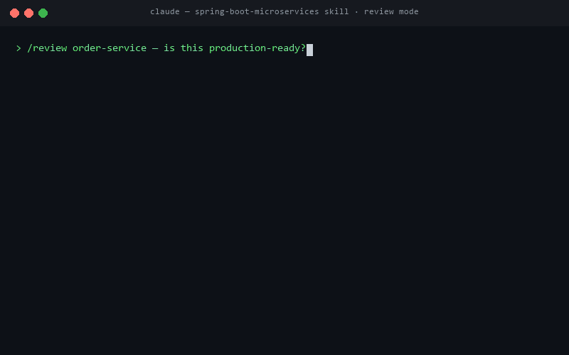

# Spring Boot Microservices Skill

> **Senior-level Spring Boot microservices expertise — design, scaffold, and review —
> encoded into one Claude Code skill that activates automatically whenever you touch a
> Spring Boot backend.**


-orange)


<p align="center">
  
</p>
<p align="center"><em>Review mode in action — the correctness-first pass flags the functional bug ahead of every convention issue (example output).</em></p>

Turn Claude into a Spring Boot specialist that builds and reviews services the way the
best teams do in 2026 — Spring Boot 4.x on Spring Framework 7, Java 25 LTS, virtual
threads, first-class observability, resilience, event-driven patterns, and
container-native deployment. It's opinionated, current, and **validated by its own
built-in eval suite** — not another list of generic tips.

## Contents

- [Why teams use it](#why-teams-use-it)
- [The three modes](#the-three-modes)
- [What it covers](#what-it-covers)
- [Installation](#installation)
- [Usage](#usage)
- [Built for real engineering](#built-for-real-engineering)
- [Validated, not asserted](#validated-not-asserted)
- [Repository structure](#repository-structure)
- [Reference library](#reference-library)
- [Customize it for your org](#customize-it-for-your-org)
- [Requirements](#requirements)
- [Versioning & compatibility](#versioning--compatibility)
- [Contributing](#contributing)
- [License](#license)

## Why teams use it

- **Consistent, senior-level judgment on every service and every review** — the same
  high standard applied across your whole team and every session, not dependent on who's
  driving or what they remembered today.
- **Opinionated modern defaults.** It doesn't just list options — it makes the call:
  modular-monolith-first when boundaries are unclear, async-by-default for cross-service
  state, Resilience4j over dead libraries, release-train-aligned Spring Cloud.
- **Reviews that find real bugs.** Its review mode runs a correctness-first pass that
  catches *functional* defects — a result fetched then ignored, the wrong identifier
  used — not just style nits, and ranks findings by real impact.
- **Always current, never guesses.** Targets the current GA generation and refuses to
  invent a version or a Spring Cloud release train it can't verify.
- **Yours to shape.** Fork it and encode your own house standards so every service in
  your org is held to the same bar.

## The three modes

The skill routes automatically based on what you ask.

| Mode | Use it for | Example prompts |
|---|---|---|
| **Design** | Service boundaries, API contracts, data ownership, sync-vs-async, modular-monolith-vs-microservices | *"Should orders and payments be one service or two?"* · *"Design the API contract for a notifications service"* |
| **Scaffold / build** | A correct, modern project or feature with the right patterns from the start | *"Scaffold a Spring Boot service with Postgres and OAuth2"* · *"Add a paginated search endpoint with validation"* |
| **Review / audit** | Judging an existing service against modern standards, worst-first | *"Review this service"* · *"Is this production-ready?"* · *"Modernize this Boot 2.7 app"* |

## What it covers

Full modern-stack depth, organized so only the relevant slice loads per task:

- **Architecture & design** — bounded contexts, modular monolith (Spring Modulith) vs
  microservices, data ownership, saga/outbox consistency, DDD-lite.
- **REST API design** — resource modeling, DTOs, Bean Validation, **Problem Details
  (RFC 9457)**, pagination, API versioning, OpenAPI.
- **Persistence** — JPA/Hibernate, Spring Data JDBC, R2DBC; transaction boundaries,
  N+1 avoidance, Flyway/Liquibase migrations, HikariCP, per-service data ownership.
- **Security** — Spring Security 6/7 (`SecurityFilterChain`), stateless OAuth2 resource
  server + JWT, method security, service-to-service auth, secure defaults.
- **Spring Cloud** — Gateway, Config Server vs K8s config, service discovery, strict
  **release-train alignment** via the BOM.
- **Resilience & communication** — Resilience4j (timeouts, retries, circuit breakers,
  bulkheads, fallbacks); modern HTTP clients (`@HttpExchange`, `RestClient`).
- **Messaging / event-driven** — Kafka vs RabbitMQ, event design, the **transactional
  outbox**, idempotent consumers, dead-letter handling, schema evolution.
- **Observability** — Micrometer metrics, tracing → **OpenTelemetry**, structured JSON
  logging with trace correlation, Actuator, K8s health probes.
- **Testing** — the test pyramid, slice tests, **Testcontainers** with
  `@ServiceConnection`, contract testing.
- **Containerization & Kubernetes** — layered/buildpack images, non-root Dockerfiles,
  GraalVM native / AOT+CDS, probes, graceful shutdown, resource limits.
- **CI/CD & software supply chain** — pipeline gates, dependency/image scanning, **SBOM**,
  **image signing & provenance (cosign/SLSA)**, build-once-promote.
- **Zero-downtime deployment & migrations** — rolling/blue-green/canary, the
  **expand/contract** database-migration pattern, feature flags, safe rollback.
- **Caching** — Spring Cache, Caffeine vs Redis, cache-aside, **invalidation strategy**,
  stampede/thundering-herd protection.
- **Async, scheduling & batch** — `@Async`, `@Scheduled` **+ ShedLock** (the multi-replica
  trap), long-running jobs, Spring Batch.
- **Modernization & upgrades** — the upgrade ladder, `javax`→`jakarta`, Netflix-OSS→modern,
  OpenRewrite, strangler-fig for monolith→microservices.
- **Compliance & data privacy** — PII handling, field-level encryption, **audit logging**,
  retention & right-to-erasure, tenant isolation.
- **API styles beyond REST** — when and how to use **gRPC, GraphQL, WebSocket/SSE**.
- **Observability SLOs** — SLIs/SLOs, error budgets, burn-rate alerting.
- **Decision tables & playbooks** — the ambiguous forks (sync vs async, JPA/JDBC/R2DBC,
  cache-or-not, scheduling, API style, upgrade-now-vs-defer) and diagnostic playbooks
  ("slow endpoint", "intermittent 500s", "flaky in prod", "zero-downtime schema change",
  "is this production-ready").

## Installation

### Option A — Claude Code plugin marketplace (recommended)

This repo is itself a Claude Code plugin marketplace — install without cloning:

```
/plugin marketplace add gauravs19/spring-boot-microservices-skill
/plugin install spring-boot-microservices@gauravs19-skills
```

Updates flow through `/plugin` like any other marketplace plugin.

### Option B — manual copy

```bash
git clone https://github.com/gauravs19/spring-boot-microservices-skill.git
cp -r spring-boot-microservices-skill/spring-boot-microservices ~/.claude/skills/
```

Either way, the skill activates automatically on Spring Boot / Java microservice work,
or you can invoke it explicitly.

## Usage

Just work normally — the skill activates when your request touches Spring Boot, Spring
Cloud, or Java microservices.

- **Design:** *"I'm building an orders platform. Where should the service boundaries be,
  and should I start with a modular monolith?"*
- **Scaffold:** *"Create a Spring Boot service (Maven, Java 25) with a Postgres
  repository, a validated REST endpoint, and Actuator health probes."*
- **Feature:** *"Add a circuit-breaker-protected call to the inventory service with a
  timeout and fallback."*
- **Review:** *"Review `order-service/` and tell me what's not production-ready, worst
  first."*

## Built for real engineering

- **Modern by default, honest about versions.** Current GA generation, and it points to
  the compatibility matrix rather than guessing — so its advice is reliable.
- **Progressive disclosure.** A lean router loads instantly; deep guidance across 15
  reference guides loads only when a task needs it.
- **Opinionated where it counts.** It actively flags real anti-patterns — distributed
  monolith, shared databases, `javax.*`/Zuul/Hystrix legacy, secrets in code, "we'll add
  observability later."
- **Both build tools.** Maven and Gradle (Kotlin DSL) templates included.

## Validated, not asserted

Most skills are a wishlist of tips. This one **ships with its own reproducible eval
suite** (`evals/`) and a results log — so its behavior is measured:

- **Zero regressions.** On an objective, `mvn test`-graded bug-fix suite, the skill
  resolves **3/3 with no test tampering** across every release — it never makes the code
  worse or misleads on concrete tasks.
- **Finds bugs a checklist misses.** On a labelled flawed service (17 planted defects),
  its correctness-first review catches the **functional logic bug** — a fetched-then-
  ignored result — and ranks it the **#1 Critical** finding, where a convention-only
  review sails right past it.
- **Every change is re-measured.** Improvements are driven by eval results, not vibes;
  see [`evals/RESULTS.md`](evals/RESULTS.md) and [`CHANGELOG.md`](CHANGELOG.md).

## Repository structure

```
spring-boot-microservices/          # the drop-in skill
├── SKILL.md                         # lean router: modes, version policy, effort triage
├── references/                      # 22 guides, loaded on demand
│   ├── architecture-and-design.md
│   ├── decisions-and-playbooks.md   # decision tables + diagnostic playbooks
│   ├── project-setup.md
│   ├── configuration-and-profiles.md
│   ├── rest-api-design.md
│   ├── api-styles-beyond-rest.md    # gRPC, GraphQL, WebSocket/SSE
│   ├── persistence-and-data.md
│   ├── caching.md                   # Spring Cache, Redis, invalidation, stampede
│   ├── security.md
│   ├── compliance-and-data-privacy.md
│   ├── spring-cloud-infra.md
│   ├── resilience-and-communication.md
│   ├── messaging-and-events.md
│   ├── async-scheduling-and-batch.md
│   ├── observability.md
│   ├── testing.md
│   ├── containerization-and-k8s.md
│   ├── ci-cd-and-supply-chain.md
│   ├── deployment-and-migrations.md # zero-downtime + expand/contract migrations
│   ├── modernization-and-upgrades.md
│   ├── principles-and-anti-patterns.md
│   └── review-checklist.md          # audit checklist + report format
└── assets/templates/                # ready-to-adapt pom.xml, build.gradle.kts,
                                      # Dockerfile, compose.yaml, application.yml

evals/                               # reproducible evaluations (see evals/README.md)
├── bugfix/                          # mvn-test-graded bug-fix suite + grader
├── review/                          # labelled flawed service + answer key
└── RESULTS.md                       # measured results across releases
```

## Reference library

| Reference | What's in it |
|---|---|
| `architecture-and-design.md` | Boundaries, modular monolith vs microservices, data ownership, saga/outbox |
| `decisions-and-playbooks.md` | Decision tables for ambiguous forks + diagnostic playbooks |
| `project-setup.md` | Spring Initializr, Maven & Gradle, structure, dependencies, virtual threads |
| `configuration-and-profiles.md` | Externalized config, profiles, config server vs K8s, secrets |
| `rest-api-design.md` | Resources, DTOs, validation, Problem Details, pagination, versioning, OpenAPI |
| `persistence-and-data.md` | JPA/JDBC/R2DBC, transactions, N+1, migrations, pooling, data ownership |
| `security.md` | Spring Security 6/7, OAuth2 resource server, JWT, method security |
| `spring-cloud-infra.md` | Gateway, Config Server, discovery, release-train alignment |
| `resilience-and-communication.md` | Resilience4j, timeouts/retries/breakers/bulkheads, HTTP clients |
| `messaging-and-events.md` | Kafka/RabbitMQ, event design, transactional outbox, idempotency, DLQ |
| `observability.md` | Micrometer, tracing → OpenTelemetry, structured logging, Actuator, SLOs/error budgets |
| `caching.md` | Spring Cache, Caffeine vs Redis, cache-aside, invalidation, stampede protection |
| `async-scheduling-and-batch.md` | `@Async`, `@Scheduled` + ShedLock, long-running jobs, Spring Batch |
| `api-styles-beyond-rest.md` | When/how to use gRPC, GraphQL, WebSocket/SSE |
| `testing.md` | Test pyramid, slice tests, Testcontainers, contract testing |
| `containerization-and-k8s.md` | Layered/buildpack images, GraalVM native, K8s probes, graceful shutdown |
| `ci-cd-and-supply-chain.md` | Pipeline gates, dependency/image scanning, SBOM, signing/provenance, promotion |
| `deployment-and-migrations.md` | Zero-downtime rollout, expand/contract migrations, feature flags, rollback |
| `modernization-and-upgrades.md` | Upgrade ladder, javax→jakarta, Netflix-OSS→modern, OpenRewrite, strangler fig |
| `compliance-and-data-privacy.md` | PII, encryption, audit logging, retention/erasure, tenant isolation |
| `principles-and-anti-patterns.md` | The cross-cutting through-lines and anti-patterns, with reasoning |
| `review-checklist.md` | Canonical audit checklist + the review report format |

## Customize it for your org

The real multiplier is making it *yours*. Fork the repo and edit the reference files to
encode your house standards — your logging format, your auth pattern, your definition of
"production-ready," your approved libraries. Then every service your team designs,
builds, or reviews with Claude is held to the same bar automatically. The structure is
built for this: the router stays lean, and your standards drop straight into the
relevant reference guide.

## Requirements

- **To use the skill:** Claude Code (or a compatible Agent-Skills host).
- **To run the evals:** JDK 21+ and Maven. See `evals/README.md`.

## Versioning & compatibility

Targets the **current GA generation** (Spring Boot 4.x / Spring Framework 7 / Java 25
LTS) and treats **Spring Boot 3.5.x** as a fully-supported conservative baseline. It
resolves Spring Cloud versions from the official compatibility matrix for your exact Boot
version and lets the BOM manage them — never guessing. See [`CHANGELOG.md`](CHANGELOG.md).

## Contributing

Spring moves fast. If a version, API, or best practice here has drifted, issues and PRs
are welcome — especially updates to the version policy and release-train alignment. If
you change skill content, please re-run the evals in `evals/` and update
`evals/RESULTS.md`.

## License

MIT — see [LICENSE](LICENSE). Copyright © 2026 Gaurav Sharma.
